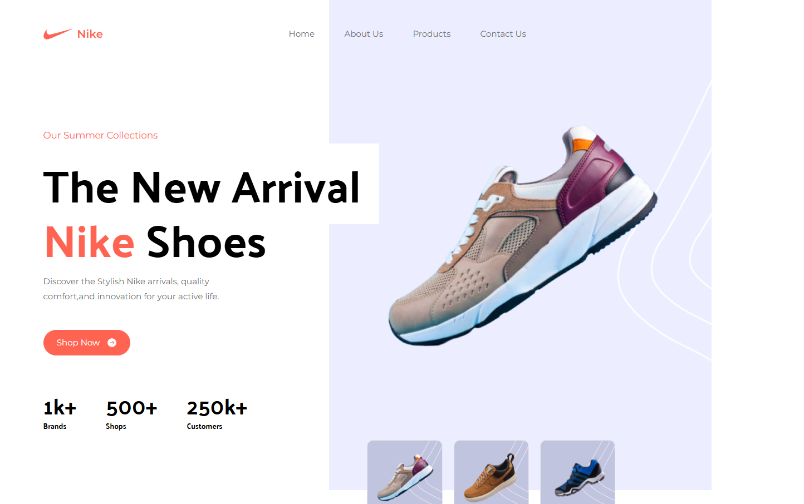

# 👟 Nike Website Clone using React & Tailwind CSS

This is a fully responsive and sleek **Nike landing page clone** built with **ReactJS** and **Tailwind CSS**. It mimics the real Nike homepage experience and is ideal for showcasing front-end development and UI skills.

## 🚀 Live Demo

👉 [Live App]([https://muhdzaheermv.github.io/nike-website/](https://nike-website-react-tailwind-sooty.vercel.app/))

## 🛠️ Tech Stack

- **ReactJS**
- **Tailwind CSS**
- **JavaScript (ES6+)**

## ✨ Features

- Fully responsive design for all devices
- Clean product showcase and layout
- Reusable components
- Tailwind utility-first styling
- Smooth scrolling UI

## 📚 Ideal For

- ReactJS + Tailwind CSS learners
- Responsive UI practice
- Landing page design
- Front-End developers building a portfolio

## 📫 Contact Me

- **📧 Email:** muhdzaheermv@gmail.com  
- **🔗 Portfolio:** [https://portfolio-lilac-eight-60.vercel.app/](https://portfolio-lilac-eight-60.vercel.app/)  
- **💼 LinkedIn:** [https://www.linkedin.com/in/muhammed-zaheer-836132244/](https://www.linkedin.com/in/muhammed-zaheer-836132244/)

## ⭐ Like This Project?

If you liked this Nike website clone or found it helpful, please give it a **⭐ star** — your support keeps me motivated to build more!

